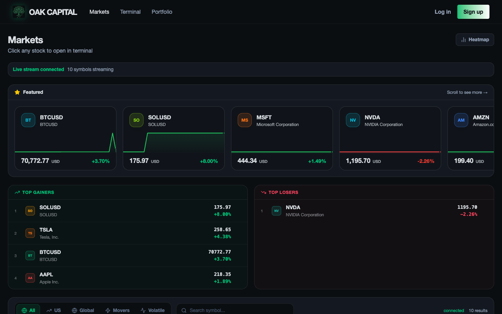

# 🏛️ OakCapital: High-Frequency Trading Engine & Quant Terminal

> 🏆 **2nd Prize — OpenSoft General Championship, IIT Kharagpur**

  
  
<em>Live Terminal: Real-time Limit Order Book | TradingView Chart with EMA indicators | Order Execution Controls</em>

 

  
  &nbsp;
  

  
<em>Left: Alpha Bot Strategy Editor (visual node-based algo trading builder) &nbsp;|&nbsp; Right: Live Portfolio with Open Positions</em>

 

  
  
<em>Markets Dashboard: Live streaming prices, Top Gainers/Losers, Featured assets</em>

 

**OakCapital** is an institutional-grade algorithmic trading platform built from the ground up for the IIT Kharagpur OpenSoft General Championship. It consists of three modules: a high-performance C++ matching engine, a concurrent Go API layer, and a professional React trading terminal.

🌐 **Live Demo:** [oakcapital.tech/terminal](https://oakcapital.tech/terminal)

---

## ⚡ Core Architecture: The C++ Matching Engine

As an aspiring Quantitative Developer, my primary focus and contribution was architecting the **Limit Order Book (LOB) and Matching Engine** entirely in C++, designed to handle HFT-scale workloads.

It was stress-tested to process **over 1.4 Million orders/second**.

- **AVL Tree Price Levels**: Custom AVL tree implementation maintains ordered price levels, guaranteeing `O(log M)` inserts for new price levels and `O(1)` access to best bid/ask at any moment.
- **O(1) Order Execution**: Each AVL node holds a doubly-linked list of resting orders, ensuring deterministic `O(1)` execution and cancellation, maintaining strict Price-Time (FIFO) priority.
- **Cache-Optimal Memory Layout**: Memory structures were deliberately chosen to maximize spatial locality (L1/L2 cache hits) and minimize TLB pressure when processing continuous order streams.

## 🌉 CGO Bridge: Go ↔ C++ Integration

To serve the matching engine over a network without sacrificing performance, I built a **CGO bridge** that exposes the C++ static library through a clean C ABI, callable directly from Go.

- The Go server calls into C++ at native speed, avoiding IPC overhead entirely.
- The layer manages concurrent REST endpoints, WebSocket broadcasting, PostgreSQL persistence, and real-time Order Book state delivery to the frontend.

## 🤖 Alpha Bot Strategy Editor (Visual Algo Builder)

A node-based visual editor (see screenshot above) that lets users compose algorithmic trading strategies without writing code:
- **Data Sources**: Price Feed nodes
- **Indicators**: SMA, EMA, RSI, MACD, Bollinger Bands
- **Conditions**: Crossover, Threshold, AND/OR logic gates
- **Actions**: Market Buy, Market Sell, Stop Loss

Nodes are wired together visually, compiled into a strategy JSON, and executed against the live matching engine in real-time.

## 📊 Markets & Portfolio Modules

- **Markets Dashboard**: Live streaming prices for 10+ symbols (BTC, AAPL, NVDA, TSLA, etc.) with a Top Gainers/Losers leaderboard
- **Portfolio Manager**: Real-time PnL tracking, open positions (LONG/SHORT), Cash, Holdings and Equity calculations

## 🛠️ Technology Stack

| Layer | Technologies |
|---|---|
| Matching Engine | C++17, STL, CMake |
| Backend / API | Go, CGO, WebSockets, PostgreSQL |
| Frontend | React, TypeScript, Vite, Tailwind CSS, TradingView Lightweight Charts |

---

> *For Quant/HFT/Core Systems recruiters: the primary C++ source is under `/backend/Matching-Engine/`*
