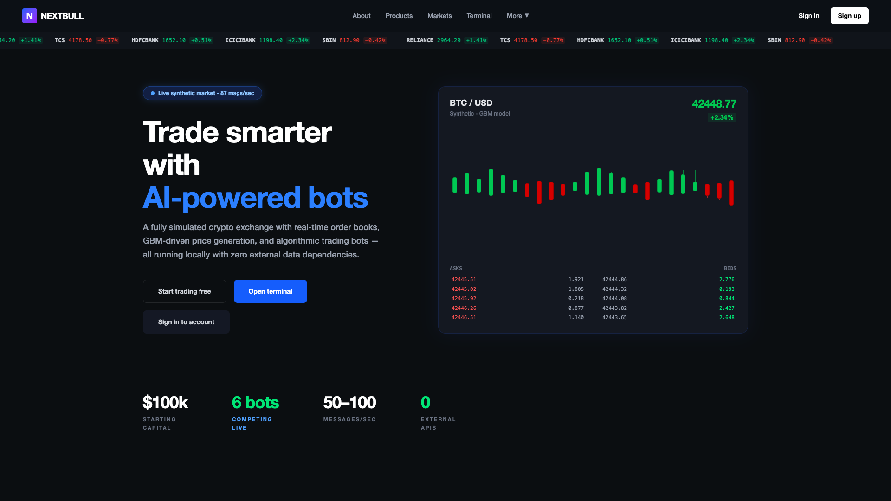
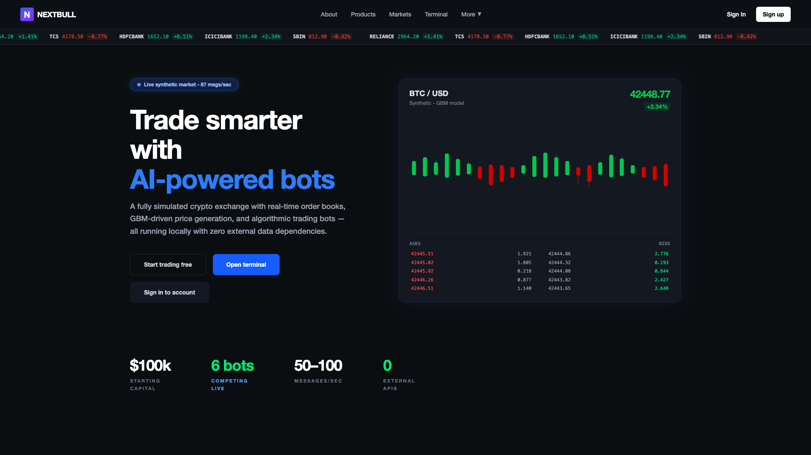
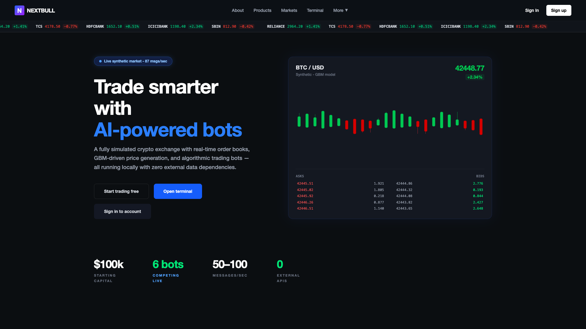

# 🏛️ OakCapital: High-Frequency Trading Engine & Quant Terminal

  

 

  
  

*Developed for the IIT Kharagpur OpenSoft General Championship (🏆 2nd Prize Winner)*

**OakCapital** is an institutional-grade algorithmic trading platform designed completely from the ground up. This repository houses the entire stack: from the ultra-low latency C++ matching engine to the real-time Go streaming server, and the comprehensive React frontend.

---

## ⚡ Core Architecture: The Matching Engine (C++)
As an aspiring Quantitative Developer, my primary focus and contribution to this project was architecting, implementing, and optimizing the **Limit Order Book (LOB) and Matching Engine** entirely from scratch in C++. 

It is designed to handle High-Frequency Trading (HFT) workloads, successfully stress-tested to process **over 1.4 Million orders per second**.

* **Algorithmic Foundation**: Implemented custom **AVL Trees** to maintain price level hierarchies, ensuring `O(log M)` inserts for new price levels and `O(1)` access for best bid/ask.
* **Order Execution**: Attached to each AVL node is a doubly-linked list representing the order queue. This guarantees deterministic `O(1)` order execution and `O(1)` cancellations maintaining strict Price-Time (FIFO) priority.
* **Cache Optimization**: Carefully managed memory layouts to prevent cache thrashing, maximizing spatial locality (L1/L2 cache hits) for instantaneous state transitions under heavy load.

## 🌉 Go/CGO Backend Integration
To interface the blistering speed of the C++ engine with network clients, I conceptualized and built a bridge connecting the engine directly into a highly concurrent **Go** backend using **CGO**.
* This bridge wraps the C++ static library into a C ABI, allowing the Go server to feed incoming trade payloads into the engine without hitting standard inter-process communication (IPC) bottlenecks.
* The Go layer manages REST routing, PostgreSQL state persistency, and WebSocket connections to broadcast the live Order Book `tick` events to the frontend.

## 🌐 The Trading Platform (React + Vite)
While my central domain is low-latency backend systems, I actively utilized modern AI-assisted development workflows ("vibe-coding") to rapidly prototype and integrate robust front-end interfaces to visualize my matching engine's output. 

The application is structured into three main views, accessible from the top right home page navigation:
1. **The Terminal**: The core trading environment featuring a live real-time Order Book, order execution controls, and integrated **TradingView** charts plotting live indicators (EMA, RSI, MACD).
2. **Markets Tab**: A live dashboard displaying global macro trends, active assets, and market depth analytics.
3. **Portfolio Tab**: A real-time risk-management interface tracking open active positions, deployed margin, and PnL metrics.
4. **Algotrading Bot Builder**: An interactive node-based visual logic builder where users can deploy algorithmic trading bots directly into the engine.

## 🛠️ Technology Stack
- **Quantitative Engine**: C++17/20, STL, CMake
- **Network & API Interop**: Go, CGO, WebSockets
- **Database Engine**: PostgreSQL 
- **Frontend Prototyping**: React.js, TypeScript, Vite, Tailwind CSS

---
*Note to Recruiters (Quant/HFT/Core Backend Engineering): Please refer specifically to the `/backend/Matching-Engine` directory for my primary C++ source contributions.*
