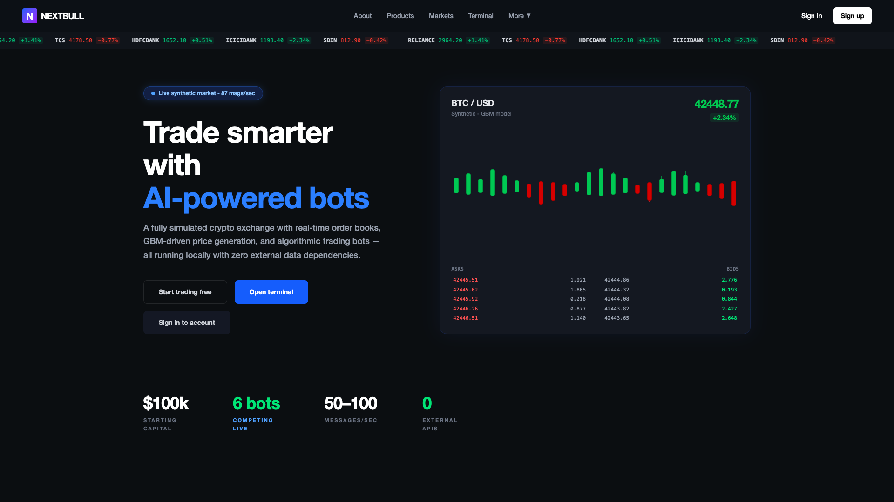
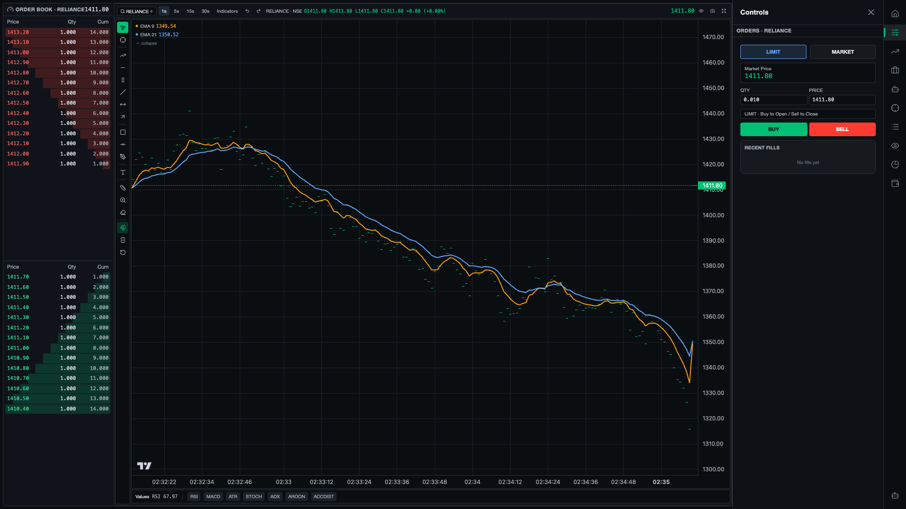
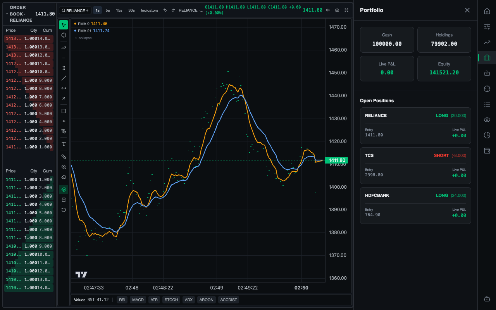
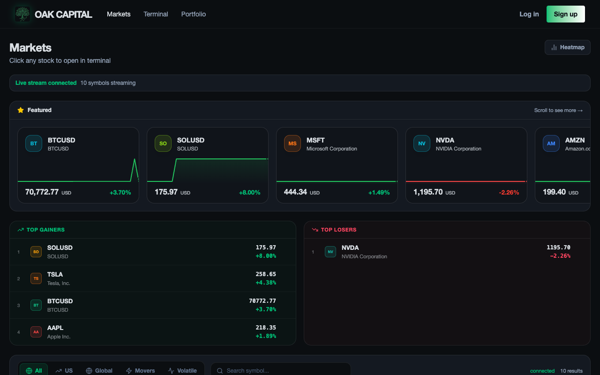

# OakCapital: HFT Trading Engine & Quant Terminal

**2nd Prize — OpenSoft General Championship, IIT Kharagpur.**

<div align="center">
  
  <p><em>Live terminal: real-time limit order book, TradingView chart, order execution controls.</em></p>
</div>

<br/>

<div align="center">
  
  &nbsp;
  
</div>

<br/>

<div align="center">
  
</div>

<br/>

An algorithmic trading platform built for the IIT Kharagpur OpenSoft General Championship: a C++ matching engine, a Go API layer, and a React trading terminal.

**Live demo:** [oakcapital.tech/terminal](https://oakcapital.tech/terminal)

## Matching engine

My primary contribution: the Limit Order Book (LOB) and matching engine, in `backend/Matching-Engine/`.

- AVL-tree price levels: `O(log M)` insert for a new price level, `O(1)` best-bid/ask lookup (M = number of distinct price levels).
- Each price level holds a doubly-linked list of resting orders — `O(1)` execution and cancellation, strict price-time (FIFO) priority.
- Served to the Go backend through a CGO bridge (C ABI, no IPC) — see `backend/Matching-Engine/include/engine_c_api.h`.

**Benchmark status:** an earlier draft of this README quoted a 1.4M orders/sec figure. I could not find a benchmark script, log, or CI run anywhere in the repo backing that number, so I removed it rather than repeat an unverifiable claim. See "Open items" below — this needs an actual order-injection benchmark committed to the repo before it's re-quoted.

## Go / API layer

Concurrent REST + WebSocket API, PostgreSQL persistence, real-time order-book state delivery. See `backend/docs/` for the API spec, architecture notes, and CGO integration details.

## Alpha Bot strategy editor

Node-based visual editor for composing trading strategies without writing code: price-feed sources, indicator nodes (SMA/EMA/RSI/MACD/Bollinger), condition nodes (crossover/threshold/logic gates), action nodes (market buy/sell, stop loss). Compiles to a strategy JSON executed against the live matching engine.

## Markets & portfolio

Live streaming prices across 10+ symbols with a gainers/losers board; portfolio manager with real-time PnL, positions, cash, and equity.

## Stack

| Layer | Technologies |
|---|---|
| Matching engine | C++17, STL, CMake |
| Backend / API | Go, CGO, WebSockets, PostgreSQL |
| Frontend | React, TypeScript, Vite, Tailwind CSS, TradingView Lightweight Charts |

## Build

```bash
cd backend/Matching-Engine
mkdir -p build && cd build
cmake .. && make
```

Produces `libmatching_engine_core.a` (static lib, linked by CGO), `libmatching_engine_c_api.dylib`, and the `matching_engine_smoke` test binary.

For the Go backend and frontend, see `backend/README.md` and `frontend/README.md`.

## Open items

- No benchmark harness exists yet for the matching engine's throughput. Adding one (order generator + `taskset`-pinned timing loop, same style as `mf-kernels`) is the highest-priority fix — see the audit for detail.
- `backend/Matching-Engine/tests/bookTests.cpp` is currently an empty file; either fill it in or remove it.
- No LICENSE file — see `LICENSE` (MIT, added).

---

*For quant/HFT/systems reviewers: the primary C++ source is under `backend/Matching-Engine/`.*
